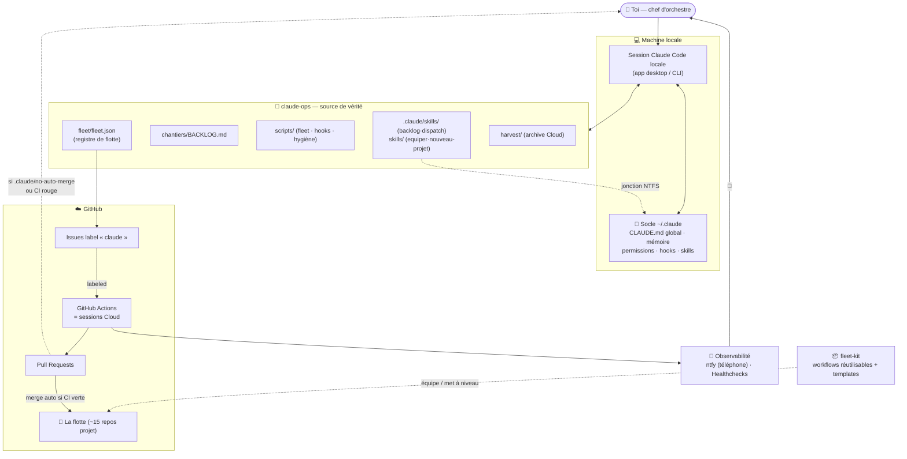
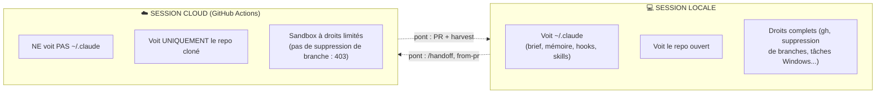
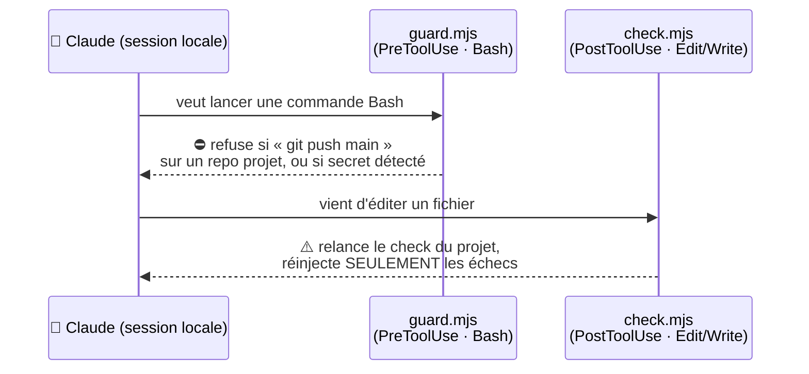
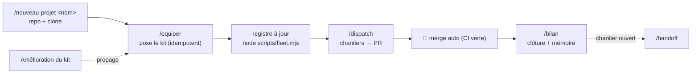
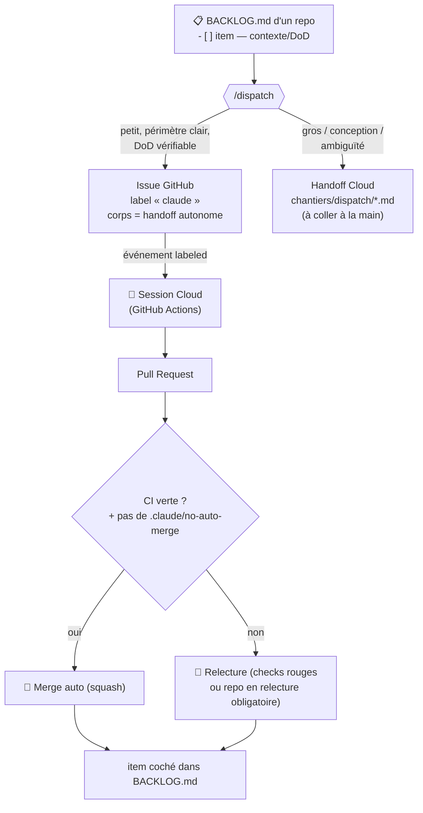
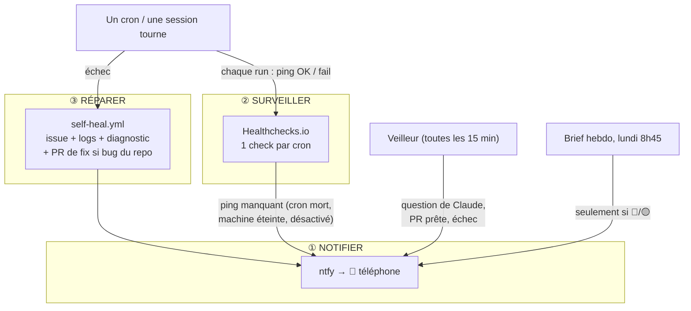

# 📖 claude-ops — mode d'emploi

> Le manuel complet du système. Il explique **ce que fait claude-ops**, **qui sont les
> acteurs**, **comment ils s'articulent**, et **les bonnes pratiques** pour bien t'en servir.
> Pour l'index rapide du dépôt, voir le [README](README.md).
>
> ℹ️ *Cet extrait public documente la **méthode**. Les dossiers d'état privés cités ici
> (`rapport/` — diagnostic & métriques, `chantiers/` — backlog & handoffs) ne sont pas
> versionnés dans ce dépôt modèle : ils restent dans l'instance privée.*

---

## En une phrase

**claude-ops est la tour de contrôle de ton usage de Claude Code** : un seul dépôt qui décrit
comment tu travailles, qui liste tes projets, qui outille tes sessions (permissions, hooks,
commandes maison), qui lance et surveille du travail automatique sur toute ta flotte de repos,
et qui archive ce qui se passe. Objectif affiché : **changer de méthode pour gagner un ×10** —
passer de « une session à la fois, tout retapé à la main » à « chef d'orchestre d'une flotte
briefée, automatisée et surveillée ».

---

## Sommaire

1. [La vue d'ensemble en une image](#1-la-vue-densemble-en-une-image)
2. [Les acteurs, un par un](#2-les-acteurs-un-par-un)
3. [Les deux mondes : Local vs Cloud](#3-les-deux-mondes--local-vs-cloud)
4. [Le socle local (`~/.claude`)](#4-le-socle-local-claude)
5. [La flotte et le registre](#5-la-flotte-et-le-registre)
6. [Le kit de flotte (`fleet-kit`)](#6-le-kit-de-flotte-fleet-kit)
7. [Le dispatch : le backlog devient exécutable](#7-le-dispatch--le-backlog-devient-exécutable)
8. [L'observabilité : plus rien ne meurt en silence](#8-lobservabilité--plus-rien-ne-meurt-en-silence)
9. [Le calendrier des automatisations](#9-le-calendrier-des-automatisations)
10. [Les commandes maison (skills)](#10-les-commandes-maison-skills)
11. [`harvest` : l'archive des sessions Cloud](#11-harvest--larchive-des-sessions-cloud)
12. [Les bonnes pratiques — domicile unique](#12-les-bonnes-pratiques--domicile-unique)
13. [Recettes pas à pas](#13-recettes-pas-à-pas)
14. [Où retrouver quoi (carte des fichiers)](#14-où-retrouver-quoi-carte-des-fichiers)
15. [Glossaire](#15-glossaire)

---

## 1. La vue d'ensemble en une image



**Comment lire ce schéma :** tu pilotes depuis une **session locale**. Cette session est
d'emblée briefée par le **socle `~/.claude`** (elle sait qui tu es et comment tu travailles) et
lit **claude-ops** (elle sait quels sont tes repos et ce qu'il reste à faire). Depuis là, tu
**équipes** tes repos avec le **fleet-kit**, tu **dispatches** des chantiers qui deviennent des
sessions **Cloud** (GitHub Actions) produisant des **PR** qui se **mergent automatiquement** dès
que la CI est verte (tu n'interviens que si un repo a demandé la relecture obligatoire, ou si
les checks échouent), et l'**observabilité** te prévient sur le téléphone dès qu'il se passe
quelque chose d'important.

---

## 2. Les acteurs, un par un

| Acteur | Rôle | Où |
|---|---|---|
| **Toi** | Chef d'orchestre. Tu cadres, tu choisis les chantiers ; les PR se mergent seules (CI verte), tu n'interviens que sur les repos en relecture obligatoire ou en cas de checks rouges. | — |
| **Session locale** | Claude Code sur ta machine (app desktop / CLI). Voit `~/.claude` **et** le repo ouvert. C'est là que tu pilotes. | Machine |
| **Session Cloud** | Claude Code exécuté par **GitHub Actions** (déclenché par une issue). Environnement éphémère isolé qui **ne voit que le repo cloné** (pas `~/.claude`). | GitHub |
| **`claude-ops`** | Le dépôt-outil **méta** : source de vérité sur *comment tu travailles*. Registre, backlog des chantiers, scripts, skills, archive. Privé. | GitHub + clone local |
| **`fleet-kit`** | Le **kit** public : workflows GitHub Actions réutilisables + templates de fichiers. On l'améliore une fois, toute la flotte en profite. | GitHub |
| **Le registre** (`fleet/fleet.json`) | **LA** liste de tes repos (type, crons, version du kit, statut). Auto-découvert. Aucune autre liste en dur nulle part. | `claude-ops` |
| **La flotte** | Tes ~15 repos projet (apps, crons, contenus). Chacun peut être « équipé » du kit. | GitHub |
| **Le socle local** (`~/.claude`) | Ce qui brief et outille chaque session locale : `CLAUDE.md` global, mémoire, permissions, **hooks**, **skills**. | Machine (sauvegardé dans `socle-local/`) |
| **Les hooks** | 2 petits scripts Node qui s'exécutent **automatiquement** pendant une session locale (garde-fou, vérif). 0 token. | `scripts/{guard,check}.mjs` |
| **Les skills** | Tes commandes maison (`/backlog`, `/bilan`, `/handoff`, `/equiper`, `/nouveau-projet`, `/dispatch`, `/reprends`). | `.claude/skills/` + `skills/` (claude-ops) et `fleet-kit` — jonctionnées dans `~/.claude/skills/` |
| **Le dispatch** | Le mécanisme qui transforme un item de backlog en issue → session Cloud → PR. | skill `/dispatch` + GitHub |
| **L'observabilité** | ntfy (notifs téléphone), Healthchecks (chien de garde des crons), self-heal (auto-réparation). | `fleet/OBSERVABILITE.md` |
| **`harvest`** | La moisson qui archive les transcripts des sessions Cloud (via les PR). | `harvest/` |

---

## 3. Les deux mondes : Local vs Cloud

Toute la mécanique repose sur une distinction à garder en tête en permanence :



| | **Local** | **Cloud** |
|---|---|---|
| Lancé par | toi, dans l'app | une issue GitHub labellisée `claude` |
| Brief | `~/.claude/CLAUDE.md` + mémoire | **le `CLAUDE.md` du repo** (le Cloud ne lit pas `~/.claude`) |
| Sait quoi faire grâce à | ta conversation, la MAP.md, le backlog | **le corps de l'issue** (handoff autonome) + MAP.md du repo |
| Produit | commits, PR, décisions | **1 PR** |
| Limite | ta présence | sandbox : pas de droits destructifs (d'où l'hygiène **en local**) |

**La conséquence n°1 :** comme le Cloud ne lit pas `~/.claude`, **chaque repo doit être
auto-suffisant** — d'où le `CLAUDE.md` + `MAP.md` posés par le kit dans chaque repo, et le fait
qu'une issue de dispatch contient un **handoff complet** (contexte + objectif + definition of
done), pas juste un titre.

**Les deux ponts :**
- **Local → Cloud** : `/handoff` génère un prompt autonome à coller dans une session Cloud (ou
  une issue). Plus besoin de re-raconter le contexte à la main.
- **Cloud → Local** : `claude --from-pr <n°>` reprend une session Cloud en local avec tout son
  contexte ; et `harvest` archive les transcripts pour la mémoire longue.

---

## 4. Le socle local (`~/.claude`)

C'est ce qui fait qu'une session locale **démarre déjà briefée** — la friction n°1 identifiée au
diagnostic (le contexte retapé à chaque fois) disparaît.

> ⚠️ `~/.claude` est **hors du dépôt** (spécifique à la machine). Le dossier
> [`socle-local/`](socle-local/) en est une **copie versionnée** (filet de sécurité pour
> restaurer sur une nouvelle machine). Claude lit `~/.claude`, **pas** `socle-local/`.
>
> Cette copie est **resynchronisée chaque semaine** par l'hygiène (`scripts/socle-sync.mjs`).
> Ce n'est pas un luxe : tant que la synchro était manuelle, elle dérivait — filet de sécurité
> périmé, donc pas de filet du tout.

Le socle a quatre pièces :

| Pièce | Fichier | Ce que ça t'apporte |
|---|---|---|
| **Brief global** | `~/.claude/CLAUDE.md` | Qui tu es, ta langue, tes règles d'efficacité, tes conventions. Chargé dans **chaque** session locale. |
| **Mémoire** | `~/.claude/projects/…/memory/` | Faits durables (profil, préférences, décisions). Rappelés automatiquement. |
| **Permissions** | `~/.claude/settings.json` → `permissions.allow` | L'**allowlist** : git, gh, npm, node… pré-autorisés → fini de valider chaque commande. |
| **Hooks + skills** | `settings.json` → `hooks` ; `~/.claude/skills/` | Garde-fous automatiques + tes commandes maison. |

### Les 2 hooks (garde-fous automatiques, 0 token)

Un hook est un script déclenché par le harness **sans consommer de contexte**. Les deux sont
**fail-open** : s'ils cassent, ils ne bloquent jamais ta session.



| Hook | Déclencheur | Rôle |
|---|---|---|
| [`guard.mjs`](scripts/guard.mjs) | avant chaque Bash | Bloque le **push direct sur `main`/`master`** d'un repo projet (branche + PR obligatoires ; exceptions : `claude-ops` et `fleet-kit`) et tout **secret** en clair dans une commande ou un commit. |
| [`check.mjs`](scripts/check.mjs) | après Edit/Write | Lance le **check rapide** du projet touché (`npm run claude:check` opt-in, ou `ruff` sur un `.py`) et ne réinjecte **que les échecs**. Vérif déterministe à 0 token. |

> Pas de hook Stop/notif : l'app Claude Code notifie déjà nativement sur le téléphone en fin de
> session locale (`agentPushNotifEnabled`). ntfy est réservé à ce qui n'a pas d'autre canal :
> le veilleur, le self-heal et le brief hebdo — voir §8.

---

## 5. La flotte et le registre

La flotte, c'est l'ensemble de tes repos. Le **registre** (`fleet/fleet.json`, généré par
`node scripts/fleet.mjs` — modèle versionné : [`fleet/fleet.example.json`](fleet/fleet.example.json))
en est la carte unique.

- **Une seule source, jamais de liste en dur.** Le registre est lu par `/dispatch`, le brief
  hebdo, la revue mensuelle, la propagation du kit et l'hygiène. Si tu as besoin de « la liste de mes repos »,
  c'est ici — nulle part ailleurs.
- **Auto-découvert.** [`scripts/fleet.mjs`](scripts/fleet.mjs) interroge GitHub (`gh repo list`)
  et remplit pour chaque repo : visibilité, branche par défaut, `type`, `.kit-version`
  installée, workflows planifiés (crons). Les champs que tu édites à la main (`type`, `statut`,
  `notes`) sont **préservés**.
- **Rafraîchir :** `node scripts/fleet.mjs` (nécessite `gh` authentifié). `/equiper` le fait
  automatiquement à la fin.

Chaque repo a un **type**, qui décide de ce que le kit lui pose :

| Type | Exemple | Déploiement typique |
|---|---|---|
| `static` | un site / un jeu web | GitHub Pages |
| `service-node` | une app Node servie en continu | Render |
| `service-python` | un service Python | serveur Python (autonome / Render) |
| `cron-node` / `cron-python` | un job planifié | cron GitHub Actions |
| `lib` | une bibliothèque / CLI | — |
| `contenu` | des notes en markdown | markdown seul (pas de CI) |
| `meta` | `claude-ops`, `fleet-kit` | l'outillage lui-même |

---

## 6. Le kit de flotte (`fleet-kit`)

**L'idée-force : améliorer une fois, propager partout.** Plutôt que de recopier des workflows
dans chaque repo, `fleet-kit` (public) héberge des **workflows réutilisables** et des
**templates**. Chaque repo n'a que des *stubs* qui appellent le kit — corriger un bug dans le
kit met à niveau toute la flotte d'un coup.

Ce que le kit pose sur un repo équipé : `CLAUDE.md`, `MAP.md`, `BACKLOG.md`, allowlist
`.claude/settings.json`, stubs de workflows (`map.yml`, `claude.yml`, `self-heal.yml`,
`pr-ready.yml` — l'auto-merge —, `ci.yml` ou `pages.yml`), labels, `.kit-version`.

> 💰 **Garde anti-gaspillage sur MAP** (2026-07-11) : à chaque push sur `main`, `map.yml` ne
> lance une session Haiku **que si le diff depuis la dernière carte le justifie** (fichiers
> ajoutés/supprimés/renommés, fichier « clé » touché — package.json, workflows, scripts —, ou
> \> 400 lignes). Sinon, run terminé sans un token. Quand elle tourne, la session reçoit le
> résumé du diff et met à jour la carte au lieu de ré-explorer. `workflow_dispatch` force.

Deux commandes gèrent tout le cycle de vie :



- **`/equiper <repo>`** — pose ou met à niveau le kit, **sans écraser l'existant** (merge doux du
  `CLAUDE.md`, union des allowlists…). Idempotent : relancer sur un repo à jour ne produit aucun
  diff. Termine par une PR + rafraîchit le registre.
- **`/nouveau-projet <nom>`** — crée le repo GitHub, le clone, l'équipe (via `/equiper`), fait le
  premier commit. Un projet **naît** donc équipé, sans divergence possible.

> ⚠️ Un réglage reste **manuel par repo** : « Actions peut créer des PR ». Le classifieur
> refuse que Claude l'active (élévation de privilège) → `/equiper` te donne la commande
> `gh api …/actions/permissions/workflow …` à lancer toi-même.

---

## 7. Le dispatch : le backlog devient exécutable

C'est le cœur du « chef d'orchestre ». La convention est simple :

> **1 item de backlog = 1 issue = 1 session Cloud = 1 PR.**



**Ce que fait `/dispatch` :**
1. Lit le registre, garde les repos `actif` **et** équipés (`kit_version != null`).
2. Lit leurs `BACKLOG.md`, présente les items `- [ ]` avec gain/effort/modèle conseillé.
3. **Anti-collision** : max 1 issue par repo à la fois (deux branches parties du même `main` se
   marcheraient dessus). Repos différents = parallèle sans limite.
4. **Tri par taille** : petit → issue (session Actions) ; gros → handoff Cloud à coller.
5. Crée l'issue avec le label `claude` (`claude:haiku` si mécanique) posé **dès la création**.
6. Plafond : **5 issues max par dispatch**. Ce n'est pas une limite de coût — tout tourne sur
   l'abonnement — mais une **taille de lot** : au-delà, les PRs et les allers-retours arrivent
   plus vite qu'on ne les absorbe.

**`/dispatch status`** — le tableau de bord **côté session** : pour chaque issue ouverte, croise
la PR liée (état, checks) et le run Actions, et **signale** les sessions probablement plantées
(issue sans PR ni run actif depuis > 1 h).

> 💡 Tu peux tout piloter **depuis le téléphone** : ouvrir/commenter une issue `claude` suffit à
> lancer ou relancer une session Cloud.

> 💰 **1 commentaire = 1 lot.** Chaque commentaire `@claude` relance une **session Actions
> complète** (re-clone + relecture de tout le fil : la recontextualisation est repayée à chaque
> réplique). Groupe donc tes **retours de relecture** sur une PR/issue en **un seul
> commentaire** — la session relit tout le fil de toute façon, et un lot cohérent donne un
> meilleur résultat qu'une rafale de petits messages.
>
> ⚠️ **L'exception compte autant que la règle** : quand une session **pose une question**, lui
> répondre est le cas **nominal** — une réponse = une relance, et c'est très bien ainsi. La
> consigne de groupage vise les retours que tu inities, jamais le dialogue qu'une session
> attend pour avancer. Se retenir de répondre, c'est laisser un chantier en rade pour rien.

---

## 8. L'observabilité : plus rien ne meurt en silence

Trois étages, du plus léger au plus grave. Détail complet : [`fleet/OBSERVABILITE.md`](fleet/OBSERVABILITE.md).



1. **ntfy** — notifications sur le téléphone, réduites à l'essentiel : les sessions locales
   notifient déjà nativement via l'app Claude Code, donc ntfy ne sert plus qu'à ce qui n'a pas
   d'autre canal. Topic privé (`~/.claude/ntfy-topic` + secret `NTFY_TOPIC`). Trois émetteurs :
   - le **veilleur** — le canal temps réel : un cron toutes les 15 min, qui tourne app fermée et
     remonte ce qui attend une décision (une session qui pose une question, une PR prête à
     merger, un échec). C'est lui qui rend le rendez-vous quotidien inutile ;
   - le **self-heal** — toujours, c'est une panne ;
   - le **brief hebdo** — le lundi matin, et seulement s'il reste du 🔴/🟡.

   ⚠️ **Sens unique** : écrire dans le topic ne déclenche rien. Pour donner un ordre depuis le
   téléphone → **une issue GitHub `claude`** (ou un tableau de bord mobile qui en crée une).
2. **Healthchecks.io** — le chien de garde. Chaque cron **pingue** son URL à chaque run ; si le
   ping n'arrive pas dans les temps (cron désactivé après 60 j, machine éteinte, retard…),
   Healthchecks alerte. Grâce : 6 h partout.
3. **Self-heal** — l'auto-réparation. Un cron qui échoue ouvre une issue avec ses logs, notifie,
   puis lance une **session Claude** qui diagnostique : si c'est un bug du repo → **PR de fix**
   automatique ; si c'est une cause externe (API tierce, quota) → commentaire, pas de code.
   💰 **Garde par signature** (2026-07-11) : chaque échec est haché (logs normalisés — dates,
   nombres, URLs neutralisés). Même signature que le dernier diagnostic = **pas de nouvelle
   session** (commentaire + ntfy seulement) ; erreur différente = nouvelle session. Réglable
   par repo via l'input `mode` du stub : `auto` (défaut), `debug` (toujours corriger, pour un
   cron en rodage), `notify-only` (jamais, pour un cron gelé).

---

## 9. Le calendrier des automatisations

Ce qui tourne tout seul, et **où** ça tourne (c'est important : certaines tâches sont locales et
ne s'exécutent que quand ton app/ta machine est allumée).

> ℹ️ Calendrier de l'**instance complète**. Dans cet extrait sont livrés : les workflows
> (inertes, `examples/workflows/`), `hygiene.ps1` et les scripts de collecte. Les **tâches
> planifiées locales de l'app** (`revue-mensuelle-flotte`, `bilan-tokens-hebdo`) ne sont pas
> incluses — leurs prompts vivent dans l'app Claude Code ; seuls leurs scripts de collecte
> (`tokens-hebdo.mjs`) sont là. Le **veilleur** relève d'une app de pilotage séparée, hors
> périmètre de cet extrait : sa ligne est gardée ci-dessous parce que le mécanisme se
> reproduit avec un simple cron GitHub Actions + `ntfy.mjs`.

| Automatisation | Quand | Où | Rôle |
|---|---|---|---|
| **Veilleur** | toutes les 15 min | **GitHub Actions** (gratuit sur un repo public) | Le canal d'alerte **temps réel**, app fermée : questions posées par une session, PRs prêtes à merger, échecs → ntfy. **0 token** (script Node pur, aucune session Claude). C'est lui qui a permis de dégrader le brief de quotidien à hebdomadaire. |
| **Brief hebdo** (`brief-hebdo.yml`) | lundi ~8h45 (cron `45 6 * * 1` UTC → dérive DST ±1 h) | **GitHub Actions** (Cloud, *always-on* : tourne même PC éteint) | Le point hebdomadaire (Haiku, CLI headless — l'action `claude-code-action` refuse les events `schedule`) : ✅ traité cette semaine · 🔴🟡 ce qui reste · 💰 tokens & activité · une suggestion de dispatch. 💰 Toute la collecte tient en **1 appel** (`scripts/brief-data.mjs`) — la session ne fait que rédiger. Les alertes au fil de l'eau sont le métier du veilleur : un rendez-vous quotidien faisait doublon. |
| **Propagation du kit** (`kit-propagation.yml`) | lundi ~8h15 | **GitHub Actions** | Les repos dont `.kit-version` est en retard reçoivent les fichiers **possédés par le kit** (skills de session + `.kit-version`) via `scripts/kit-propager.mjs` : PR mécanique, mergée dès CI verte, `.claude/no-auto-merge` respecté. **0 token** (pur script). Flotte à jour = no-op silencieux. |
| **Revue mensuelle** (`revue-mensuelle-flotte`) | 1er du mois | Tâche planifiée **locale de l'app** | Le système propose ses propres optimisations (lit l'archive locale, les bilans tokens du mois et `scripts/meta-ratio.mjs` — la part du **méta** dans l'activité). **Jardine les consignes** : elle en retire ou fusionne au moins une à chaque passage. |
| **Bilan tokens hebdo** (`bilan-tokens-hebdo`) | **dimanche 21h** | Tâche planifiée **locale de l'app** (Haiku) | Où sont passés les tokens (local ccusage + cloud Actions), effet des gardes, **coût 7 j par automatisme**, comparaison à la semaine précédente, 0-3 optimisations simples. 💰 Collecte en **1 appel** (`scripts/tokens-hebdo.mjs`). Rapport versionné `rapport/tokens/AAAA-SNN.md`, **lu par le brief du lundi matin** — il n'a donc pas de notification propre. Le dimanche n'est pas un détail : il doit tourner **avant** le brief, et c'est le seul jour où la fenêtre 7 j coïncide avec la semaine ISO archivée. |
| **Hygiène GitHub** (`ClaudeOps-HygieneGitHub`) | lundi 9h | **Planificateur Windows** (PowerShell) | Supprime les branches `claude/*` mergées, signale PR/branches oubliées et la **dérive de kit**, puis **synchronise le socle** (`scripts/socle-sync.mjs` : `~/.claude` → `socle-local/`, sans quoi la sauvegarde dérive). Ping Healthchecks. En local (le Cloud n'a pas les droits de suppression). |
| **Harvest mensuel** | autour du 1er du mois | **Toi + snippet console** (0 token) | Archive incrémentale des sessions Cloud : coller `harvest/harvest-console.js` dans la console de claude.ai/code, déplacer les fichiers, `node harvest/split-harvest.mjs`. Mensuel car sa **seule consommatrice** est la revue mensuelle. Non automatisable sans stocker les cookies claude.ai — une session de navigateur est requise. Chien de garde Healthchecks `claude-ops/harvest-mensuel`, grâce 72 h. |
| **Crons repo** — chaque projet à cron (ex. un job de publication quotidien, une veille bi-hebdo, un digest hebdo) | selon repo | **GitHub Actions** | Le métier de chaque projet. Chacun sous chien de garde + self-heal. |

> **Pourquoi PowerShell pour l'hygiène et Node pour le reste ?** Les scripts lancés **par
> Claude** sont en Node/Python (PowerShell est bloqué pour Claude sur cette machine). PowerShell
> reste réservé aux **tâches planifiées Windows** que tu déclenches en tant qu'humain (l'hygiène
> a besoin d'accéder au trousseau Windows pour `gh`).

---

## 10. Les commandes maison (skills)

Sept skills industrialisent ta méthode, installées dans `~/.claude/skills/` par **jonction NTFS**
(la source est vue immédiatement, sans copie). Elles sont **réparties selon leur portée cloud**
(une session Cloud ne lit que le `.claude/skills/` du repo ouvert, jamais ton `~/.claude/`) :
`/backlog` et `/dispatch` dans `claude-ops/.claude/skills/` ; `/bilan`, `/handoff`, `/reprends`
dans `fleet-kit` (posées dans chaque repo équipé par `/equiper`) ; `/equiper` et `/nouveau-projet`,
outils locaux, dans [`skills/`](skills/).
(Cet extrait public ne versionne que les **quatre** skills qui vivent dans ce repo ; les trois
autres sont dans `fleet-kit` — d'où l'écart avec le compte du README.)

| Skill | Quand l'invoquer | Produit |
|---|---|---|
| [`/backlog`](.claude/skills/backlog/SKILL.md) | « qu'est-ce qu'il reste à faire », `/backlog <repo> <n°> [cloud]` | vue agrégée des BACKLOG.md de la flotte ; traite un item **dans la session courante** (local) ou l'envoie en issue `claude` |
| [`/dispatch`](.claude/skills/dispatch/SKILL.md) | « distribue le backlog », « où en sont les sessions » | issues `claude` labellisées, ou statut des sessions en cours |
| [`/bilan`](https://github.com/Thibaud888/fleet-kit/blob/main/templates/common/.claude/skills/bilan/SKILL.md) | « on s'arrête », « fais le point » | BACKLOG à jour + mémoire écrite + handoff éventuel + récap des PR |
| [`/handoff`](https://github.com/Thibaud888/fleet-kit/blob/main/templates/common/.claude/skills/handoff/SKILL.md) | « prépare la reprise » | `chantiers/<slug>.md` + prompt autonome prêt à coller |
| [`/reprends`](https://github.com/Thibaud888/fleet-kit/blob/main/templates/common/.claude/skills/reprends/SKILL.md) | « reprends », « tu t'es arrêté par manque de tokens » | reprend le travail interrompu (tokens/limite épuisés) là où il s'était arrêté |
| [`/equiper`](skills/equiper/SKILL.md) | « équipe `<repo>` » | PR posant/mettant à niveau le kit + registre à jour |
| [`/nouveau-projet`](skills/nouveau-projet/SKILL.md) | « démarre un projet » | repo + clone + kit complet + 1er commit |

> **`/dispatch` ou `/backlog` ?** `/dispatch` = distribution **en lot** vers le cloud (tri par
> taille, anti-collision, plafond 5). `/backlog` = **consultation** de toutes les tâches + geste
> **unitaire**, avec le choix local (session courante — pour l'ambigu ou le gros) ou cloud
> (fire-and-forget). FleetView offre les mêmes gestes depuis le téléphone (⚡ issue, 🌩 session cloud).

---

## 11. `harvest` : l'archive des sessions Cloud

Le Cloud est ton activité dominante, mais éphémère. `harvest` en garde une trace durable.

- **Principe** : chaque PR créée en session Cloud contient une URL `claude.ai/code/session_<id>`
  → on peut **inventorier** puis **rapatrier** les transcripts.
- **Rythme** : moisson **mensuelle**, autour du 1er du mois — un **snippet collé dans la console
  du navigateur** ([`harvest-console.js`](harvest/harvest-console.js), 0 token, aucun modèle dans
  la boucle) ; procédure : [`harvest/README.md`](harvest/README.md). Mensuel parce que sa
  **seule consommatrice** est la revue mensuelle, qui suit juste après ; et manuel parce que
  l'automatiser supposerait de stocker les cookies claude.ai — une session de navigateur
  authentifiée est requise. Chien de garde : `claude-ops/harvest-mensuel`, grâce 72 h.
- **Décision durable** : l'archive **reste locale** (`archive/` est gitignorée) — les
  transcripts peuvent contenir des secrets collés en session. C'est pour ça que la **revue
  mensuelle tourne en local** : elle peut la lire.
- **Angle mort connu** : les sessions Cloud **sans PR** n'apparaissent pas dans l'inventaire ;
  en cas de doute, comparer le compte sur `claude.ai/code` avec `inventory.json`.

---

## 12. Les bonnes pratiques — domicile unique

Ce guide **ne réénonce plus les règles**. Il dit où elles habitent.

Elles étaient listées ici *et* dans le `CLAUDE.md` global *et* dans les `SKILL.md`. Trois copies
d'une même consigne, c'est trois occasions de diverger — et c'est arrivé : la version lue par les
sessions et celle lue par l'humain ont fini par se contredire. D'où la règle du **domicile
unique** :

| Type de règle | Domicile | Exemples |
|---|---|---|
| Transverse (vaut pour toute session) | le **`CLAUDE.md` global** | réflexes de session · git & merge · grain de travail · routage de modèles · contraintes de la machine · clôture |
| D'exécution (propre à une commande) | le **`SKILL.md`** de cette commande | l'anti-collision de `/dispatch`, la numérotation stable de `/backlog`… |
| Propre à un repo | le **`CLAUDE.md` du repo** | conventions, commandes de vérification |

Ce guide, le README et les `MAP.md` **pointent** vers ces domiciles ; ils ne recopient pas.
Modèle de socle à adapter : [`socle-local/CLAUDE.example.md`](socle-local/CLAUDE.example.md).

### La règle des règles

Toute nouvelle consigne doit **nommer le besoin qu'elle sert**, parmi six :

1. simple à utiliser · 2. automatise sans moi · 3. me questionne quand il le faut vraiment ·
4. vision globale des projets · 5. économe en tokens · 6. utilisable depuis le PC **et** le
téléphone.

Une consigne qui n'en sert aucun n'entre pas. Et la revue mensuelle **retire ou fusionne au
moins une consigne** à chaque passage — sans ce jardinage, un socle ne fait que grossir, et un
socle trop long n'est plus lu.

> 🧭 Deux fossiles purgés par ce jardinage, pour l'exemple. « Tenir le budget sous 50 €/mois » :
> les sessions tournent sur l'abonnement, ce n'est plus l'euro qui est rare mais la **limite
> d'usage** — le routage de modèles sert toujours, mais pas pour la raison affichée. Et
> « merger dès que la CI est verte » ne disait rien des repos **sans CI**, où « sans CI »
> revenait à « à l'aveugle » : ces PR ne se mergent désormais que si leur corps porte une
> section `## Vérification` (la commande lancée et son résultat).

---

## 13. Recettes pas à pas

### 🆕 Je démarre un nouveau projet
Session locale → `/nouveau-projet <nom>`. Réponds au type et à la visibilité. Le repo naît
équipé (kit, CLAUDE.md, MAP.md, CI, labels), premier commit poussé, registre à jour. Enchaîne
sur un `/handoff` pour lancer le premier chantier.

### ▶️ Je fais avancer un repo existant
1. `/equiper <repo>` s'il n'est pas encore au kit (ou si `kit_version` a pris du retard).
2. Renseigne des items `- [ ]` dans son `BACKLOG.md`.
3. `/dispatch` → choisis les items → des issues partent en sessions Cloud → des PR arrivent et
   se mergent seules si la CI est verte.
4. Tu n'interviens que si un repo est en relecture obligatoire (`.claude/no-auto-merge`), ou si
   des checks sont rouges (`/dispatch status` te montre ce qui traîne).

### 🔀 Je lance plusieurs chantiers en parallèle
`/dispatch`, sélectionne des items **sur des repos différents** (l'anti-collision limite à 1 par
repo). Suis l'avancement avec `/dispatch status` — depuis le téléphone si tu veux.

### ⏸️ Je reprends un travail interrompu
- Si une PR existe : `claude --from-pr <n°>` dans le repo → tout le contexte revient.
- Sinon : ouvre la dernière session et colle le `chantiers/<slug>.md` produit par `/handoff`.

### 🧹 Je clôture ma session
`/bilan`. Il met à jour le BACKLOG, écrit la mémoire, et propose un `/handoff` s'il reste du
travail.

### 🚨 Un cron a planté
Tu reçois une notif ntfy. Le **self-heal** a déjà ouvert une issue avec les logs (et, si c'est
un bug du repo, une PR de fix). Va voir l'issue `self-heal` : soit tu merges la PR, soit tu
traites la cause externe signalée.

### 🔧 J'améliore un comportement sur toute la flotte
Modifie le **`fleet-kit`** (workflow réutilisable ou template) et publie une nouvelle `VERSION`.
La suite est automatique, par deux chemins différents :

- les **workflows** s'appliquent **instantanément** — les repos n'en hébergent qu'un stub qui
  appelle le kit en `@main` ; il n'y a rien à propager ;
- les **fichiers possédés par le kit** (skills de session, `.kit-version`) sont propagés le
  lundi suivant par `kit-propagation.yml` — ou tout de suite avec
  `node scripts/kit-propager.mjs`.

`/equiper` ne sert plus qu'au **premier équipement** d'un repo et aux fusions qui demandent du
jugement (CLAUDE.md, allowlist, stubs) : celles-là ne s'automatisent pas, elles écraseraient du
travail local.

---

## 14. Où retrouver quoi (carte des fichiers)

> Cette carte décrit une **instance complète**. Dans cet extrait public, `rapport/`, `chantiers/`,
> `harvest/archive/` et les fichiers de socle non-`.example` (dont `memory/`) n'existent pas —
> c'est l'état privé de l'instance. Les modèles fournis : `socle-local/*.example.*` et
> `fleet/fleet.example.json`. Les workflows livrés sont dans `examples/workflows/` (inertes).

```
claude-ops/
├── README.md                 ← index rapide du dépôt
├── GUIDE.md                  ← CE mode d'emploi
├── rapport/
│   ├── diagnostic.md         ← l'état des lieux fondateur (le « pourquoi »)
│   ├── usage-cloud.md        ← analyse des transcripts Cloud
│   └── hygiene/              ← rapports d'hygiène datés
├── fleet/
│   ├── fleet.json            ← ⭐ LE registre de flotte (source unique)
│   └── OBSERVABILITE.md      ← ntfy / Healthchecks / self-heal en détail
├── chantiers/
│   ├── BACKLOG.md            ← portefeuille des chantiers d'optimisation
│   └── <chantier>.md         ← 1 fichier = 1 prompt de handoff autonome
├── scripts/
│   ├── fleet.mjs             ← rafraîchit le registre (auto-découverte)
│   ├── kit-propager.mjs      ← propage le kit vers les repos en retard (PR + merge)
│   ├── brief-data.mjs        ← toute la collecte du brief en 1 appel
│   ├── tokens-hebdo.mjs      ← collecte du bilan tokens (archive du dimanche)
│   ├── socle-sync.mjs        ← ~/.claude → socle-local/ (appelé par l'hygiène)
│   ├── meta-ratio.mjs        ← part du méta dans l'activité (revue mensuelle)
│   ├── guard.mjs             ← hook : anti push-main + anti-secrets
│   ├── check.mjs             ← hook : vérif post-édition
│   └── hygiene.ps1           ← hygiène GitHub hebdo + synchro du socle (lancée par Windows)
├── .claude/skills/           ← /backlog /dispatch (versionnées → lues aussi en session Cloud)
├── skills/                   ← /equiper /nouveau-projet (outils locaux)
│   └── <skill>/SKILL.md      ← (/bilan /handoff /reprends : désormais dans fleet-kit, posées par /equiper)
├── examples/workflows/       ← workflows d'exemple, livrés INERTES (brief, dispatch, codex — à activer)
├── harvest/                  ← moisson + archive des sessions Cloud
│   ├── README.md             ← procédure de moisson mensuelle
│   └── archive/              ← transcripts (gitignoré, local)
└── socle-local/              ← copie versionnée de ~/.claude (filet de sécurité)
    ├── CLAUDE.md             ← brief global
    ├── settings.json         ← permissions + hooks
    └── memory/               ← fiches mémoire
```

**Points d'entrée dans l'ordre :** [README](README.md) (index) → **ce GUIDE** (comment ça
marche) → [`fleet/fleet.example.json`](fleet/fleet.example.json) (le schéma du registre) →
ton `chantiers/BACKLOG.md` (quoi faire — propre à ton instance).

> 💡 **Astuce Obsidian** : ouvre tout ton dossier de repos comme vault (lecture seule, sans
> plugin de sync — la source de vérité reste git). La recherche couvre d'un coup tous les
> `BACKLOG.md`, `MAP.md` et rapports de la flotte, et les schémas Mermaid de ce guide s'y
> affichent.

---

## 15. Glossaire

| Terme | Définition |
|---|---|
| **Flotte** | L'ensemble de tes repos GitHub, vus comme un parc à piloter d'un seul endroit. |
| **Registre** | `fleet/fleet.json` : la carte auto-découverte de la flotte. Source unique. |
| **Kit de flotte** | `fleet-kit` : workflows réutilisables + templates posés sur chaque repo « équipé ». |
| **Équiper** | Poser (ou mettre à niveau) le kit sur un repo, via `/equiper`. Idempotent. |
| **Dispatch** | Transformer des items de backlog en issues → sessions Cloud → PR. |
| **Session Cloud** | Claude Code exécuté par GitHub Actions ; ne voit que le repo cloné. |
| **Socle local** | Le contenu de `~/.claude` : brief, mémoire, permissions, hooks, skills. |
| **Hook** | Script auto-déclenché pendant une session locale (garde-fou / vérif / notif), 0 token. |
| **Skill** | Commande maison (`/bilan`, `/dispatch`…) définie par un `SKILL.md`. |
| **Handoff** | Prompt autonome capturant l'état d'une session pour qu'une autre la reprenne sans contexte retapé. |
| **Self-heal** | Auto-réparation : un cron qui échoue déclenche diagnostic + PR de fix. |
| **Dérive de kit** | Écart entre la `.kit-version` d'un repo et la dernière version de `fleet-kit` ; signalée par l'hygiène. |
| **Chantier** | Unité de travail : un item de backlog cadré pour tenir dans une session (souvent un fichier de handoff `chantiers/<slug>.md`). |
| **Moisson** | Synonyme de harvest : l'archivage mensuel des transcripts des sessions Cloud. |
| **FleetView** | Tableau de bord mobile de la flotte (app séparée, non incluse dans cet extrait) : les gestes de `/backlog` et `/dispatch` depuis le téléphone. |
| **Codex** | Boîte à idées : des issues « idée » sur le repo méta, cadrées automatiquement par `codex-cadrage.yml` puis promues au BACKLOG du bon repo. |
| **Repo méta** | `claude-ops` et `fleet-kit` : l'outillage lui-même (commit direct sur `main` autorisé). |
| **`.claude/no-auto-merge`** | Marqueur posé dans un repo pour désactiver le merge automatique des PR et forcer la relecture humaine sur ce repo précis. |

---

> **Ce guide est vivant.** Quand un mécanisme change, mets-le à jour ici en même temps que le
> code — c'est la porte d'entrée pour comprendre le système. `claude-ops` étant un repo méta, tu
> peux committer ce fichier directement sur `main`.
